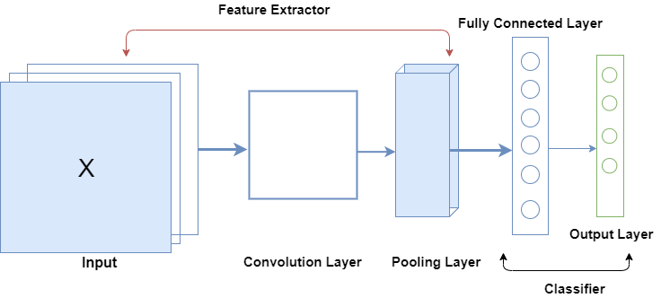

# Simple Implementation of Convolutional Neural Network (CNN)

## Introduction
### Hand Written Digits recognition using the [MNIST Dataset](http://yann.lecun.com/exdb/mnist/)
#### Open *simple_cnn.ipynb* to run code in blocks or open *simple_cnn.py* to run whole code

CNN are multi-layer neural networks most commonly applied to analyzing visual imagery. 

The diagram below illustrates a simple CNN

**Major Steps in Building CNN**

1. **Convolution**

   ***Parameters***: filters, kernel size, activation function, input_shape(for the first Conv Layer)

2. Pooling

   ***Parameters***: pool size, strides

3. Flattening

4. Fully Connected layers 

   ***Parameters***: number of neurons, for the last layer(specify number of classes), activation function

   Fully connected layers are defined using the **Dense class**  

   

## In this implementation we are going to use [keras](https://keras.io) to build the model

